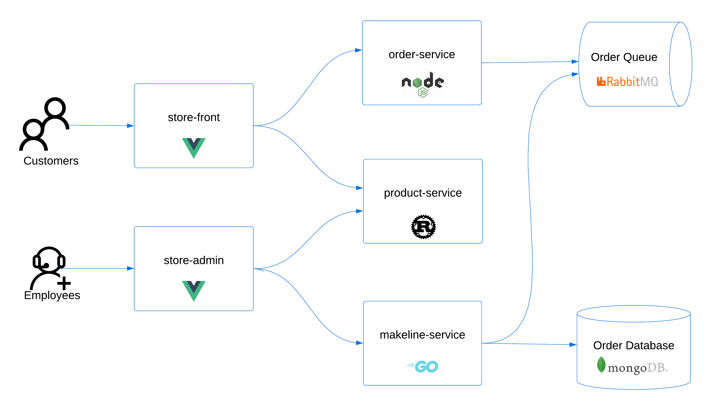

# devops-portfolio-azure-iac
Contains a small IaC project to showcase as devops portfolio

## Requirements
- Azure Subscription
  - Microsoft Storage Registration
- Azure CLI
- Terraform

## References

- Infrastructure Diagram
- [Quickstart: Deploy an Azure Kubernetes Service (AKS) cluster using Terraform](https://learn.microsoft.com/en-us/azure/aks/learn/quick-kubernetes-deploy-terraform)
- [Azure Samples: AKS Store Demo](https://github.com/Azure-Samples/aks-store-demo)